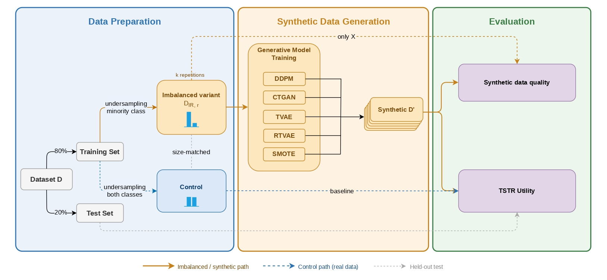

# Impact of Class Imbalance on Synthetic Tabular Data Generation: An Empirical Study

> Adriano Machado, Maria Abreu, Moisés Santos, Carlos Soares, Marília Barandas, Mariana Oliveira.

> Faculty of Engineering, University of Porto · LIACC · Fraunhofer AICOS Portugal.

## Abstract

Class imbalance is a common issue that affects machine learning performance in certain high-impact applications, such as fraud detection and healthcare. Synthetic data generation has long been used as a data augmentation technique to deal with class imbalance. We focus on fully synthetic data generation as a replacement for real-world datasets rather than augmentation, which has more recently emerged as a potential solution to issues related to data scarcity and privacy. Widely used data synthesisers, like most machine learning models, may be vulnerable to class imbalance in their training data. However, the impact of class imbalance on the quality and utility of generated synthetic data remains poorly understood. In this work, we conduct an empirical study on the impact of varying degrees of class imbalance on state-of-the-art tabular generative models. Using six benchmark datasets, we force increasing imbalance ratios by randomly undersampling the minority class and investigate degradation in synthetic data quality, privacy, and utility in a
downstream classification task. We observed some degradation in utility across most datasets and models, even after controlling for overall sample size. This effect, particularly pronounced for CTGAN and DDPM, may be partly explained by the synthesisers’ failure to generate balanced datasets as requested during conditional generation, especially under severe imbalance. Quality and privacy metrics remained relatively stable at the aggregate level, potentially masking class-specific degradation.

## Methodology



Each dataset is split 80/20 (train/test). The training set is used to build imbalanced
variants (imbalance ratios `IR ∈ {1, 3, 5, 7, 10, 20, 50, 100}`, 10 repetitions each) and
a **size-matched control** that keeps the original class balance isolating the effect of
imbalance from that of data scarcity. Each variant trains five generators, which are
sampled to produce balanced synthetic sets. 

| Component | Choices |
|---|---|
| Generators | CTGAN, TVAE, RTVAE, DDPM, and SMOTE (used as a synthesiser) |
| Generative library | [`synthcity`](https://github.com/vanderschaarlab/synthcity) |
| Quality metrics | [`pymdma`](https://github.com/fraunhoferportugal/pymdma) |
| Datasets | Mammographic Mass · Monks · Vote · Phishing · Credit · Auto Mpg |

## Repository structure

```
config/
  config.yaml      # experiment parameters (imbalance ratios, generators, repetitions, ...)
  datasets.yaml    # dataset registry (target column, paths)
  config.py        # config loader
src/
  run_experiment.py       # main experimental pipeline
  <dataset>/              # data-preparation notebooks
data/
  raw/         # original datasets
  processed/   # train/test splits and imbalanced/control variants
  synthetic/   # generated synthetic datasets (per run)
figs/          # paper figures
```

## Setup

```bash
pip install synthcity pymdma scikit-learn pandas numpy pyyaml joblib psutil
```

## Usage

```bash
# List the available datasets
python src/run_experiment.py --list-datasets

# Run the pipeline on a single dataset
python src/run_experiment.py --dataset credit

# Run on every registered dataset
python src/run_experiment.py --dataset all
```